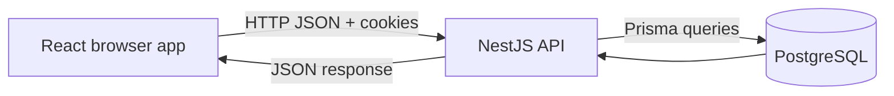
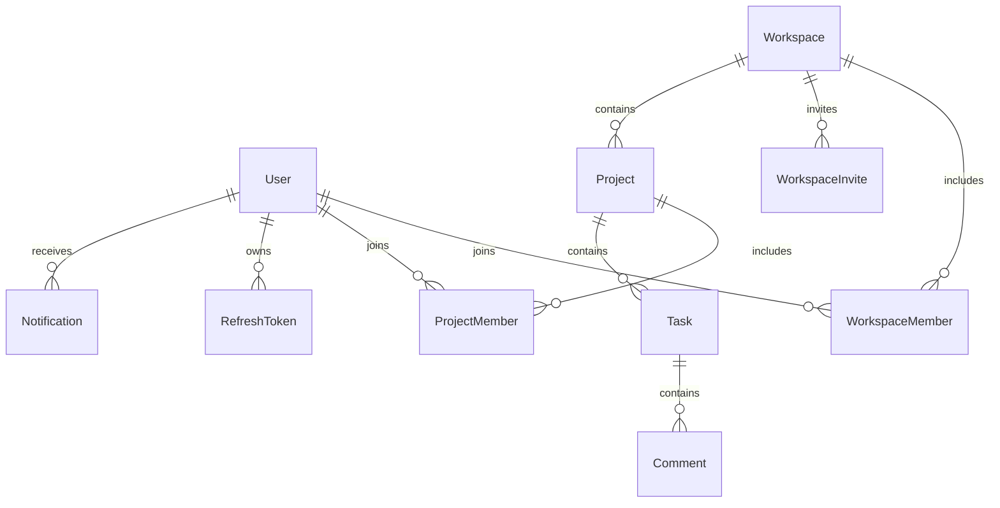

# Learn the GraSyn backend from your own code

New to backend development? Begin with [the study roadmap and frontend next steps](START_HERE.md), then return here for the code walkthrough.

Read this beside the source files. The aim is to predict what the code will do, trace it in a debugger, and then change it safely. You do not need to memorize NestJS decorators.

## 1. What you built

GraSyn is a team workspace application. A user joins a workspace, creates projects, creates and assigns tasks, discusses them through comments, and sees activity and notifications.

The frontend presents these actions. The backend decides whether they are valid, whether the user has permission, and what must be saved. PostgreSQL keeps the saved state after the server restarts.



Your stack has distinct jobs:

| Tool | Job in this project |
| --- | --- |
| Node.js | Runs the compiled JavaScript server |
| TypeScript | Checks your code's types during development/build |
| NestJS | Organizes routes, dependencies, validation, guards, and errors |
| Express | Underlying HTTP server adapter |
| Prisma | Generates a typed database client and manages schema migrations |
| PostgreSQL | Stores rows and enforces database constraints |
| class-validator / class-transformer | Validate and transform incoming request values |
| Argon2 | Hashes passwords |
| JWT | Signs short-lived access credentials |
| Jest / Supertest | Test logic and real HTTP behavior |

TypeScript cannot validate a stranger's JSON over the network. Runtime validation is still necessary.

## 2. Find your way around

Start with `src/main.ts`, `src/setup-app.ts`, `src/app.module.ts`, then one feature's controller and service.

Each feature module registers its controllers and services. Nest creates services and injects their dependencies through constructors. For example, `TasksService` asks for `PrismaService`, `AccessService`, and `EventsService`. You don't manually construct these in application code.

`PrismaModule` and `CommonModule` are global, so their exported services are available across features. The JWT module is also global. A normal non-global module must export a provider and be imported by consumers.

The other folders have specific purposes:

- `dto/`: shapes and validators for inputs.
- `common/guards/`: authentication before handlers run.
- `common/decorators/`: helpers such as `@Public()` and `@CurrentUser()`.
- `common/filters/`: turn exceptions into consistent HTTP errors.
- `prisma/schema.prisma`: database models and relations.
- `prisma/migrations/`: versioned SQL describing database changes.
- `prisma/seed.ts`: optional destructive demo-data setup.
- `test/`: integration tests against PostgreSQL.
- `dist/`: generated JavaScript; edit `src/`, not `dist/`.

A controller answers “which HTTP request calls this operation?” A service answers “what rules and database operations implement it?” Keeping these apart lets you test business rules without starting an HTTP server.

## 3. Trace one request end to end

Imagine creating a task:

```http
POST /api/projects/PROJECT_ID/tasks
Content-Type: application/json
Cookie: grasyn_access=...

{"title":"Build the login screen","priority":"HIGH"}
```

Follow it in this order:

1. `main.ts` starts Nest, configures Swagger, and listens on the configured port.
2. `setup-app.ts` installs security headers, cookie parsing, origin checking, CORS, the `/api` prefix, validation, and the error filter.
3. The global `AuthGuard` reads the access cookie, verifies the JWT, loads the user, and attaches the safe user fields to the request. Public routes skip authentication. The throttler guard checks request limits.
4. `ValidationPipe` builds a `CreateTaskDto`, trims the title, checks length and enum values, and rejects unknown properties.
5. `TasksController.create()` receives the authenticated user, project ID, and DTO, then delegates to `TasksService.create()`.
6. `AccessService.requireProject()` finds the project and checks the user's membership in its workspace. If an assignee was supplied, that person must also belong to the workspace.
7. A database transaction locks the project row, determines the next position, inserts the task, records activity, and optionally creates an assignment notification.
8. The transaction commits and the service returns `{ task }`. Nest serializes it to JSON. Nest POST handlers here normally return HTTP 201.

Notice that the browser doesn't supply `creatorId` or `workspaceId`. The server derives those from trusted authentication and the stored project. Accepting them directly would let callers impersonate someone or mislabel team data.

Try a debugger breakpoint at the controller, then step into the service and access helper. Predict the query before stepping forward.

## 4. Understand the database

Read `prisma/schema.prisma` with this map:



`WorkspaceMember` is a join table: one user can belong to many workspaces and one workspace can contain many users. It also stores the role for that particular membership. A user's role is not global.

`@@unique([workspaceId, userId])` prevents duplicate memberships even if two requests arrive simultaneously. A preliminary “does it exist?” query improves the message but cannot replace this database constraint.

`@id` identifies a row. `@default(cuid())` generates identifiers. `@default(now())` sets creation time. `@updatedAt` updates modification time through Prisma. `String?` or `DateTime?` means the column can be null. Enums restrict values to a known set.

`@relation(...)` specifies foreign keys and links between models. `onDelete: Cascade` removes dependent rows when their parent is deleted. This is why deleting a workspace can remove projects, tasks, and comments. Other relations restrict deletion instead. Read the relation before deleting anything.

`@@index(...)` helps PostgreSQL find matching rows efficiently. An index costs storage and write work, so you choose it to support real query patterns. The task index `(projectId, status, position)` matches board queries.

Some fields are repeated for convenient filtering: tasks and comments contain workspaceId even though the workspace can also be found through their parents. The services maintain that relationship; the schema doesn't enforce every possible cross-table consistency rule. See the review report before adding direct database scripts.

Other models:

- `RefreshToken`: a hash of a session-refresh credential, its user, and expiry.
- `WorkspaceInvite`: email, requested role, random token, and expiry.
- `ActivityEvent`: user-visible events about projects/tasks/comments.
- `Notification`: a message for one user, optionally linked to a resource, with `readAt` for unread state.
- `AuditEvent`: workspace/member administrative actions. There is no public audit-list controller.

`prisma generate` produces client code from the schema. It does not modify your database. Migrations modify the database. Seeding inserts demo records and, in this project, first deletes existing records. These are three separate operations.

## 5. Authentication: who is calling?

Read `auth.service.ts`, `auth.controller.ts`, `auth.module.ts`, `common/cookies.ts`, and `common/guards/auth.guard.ts`.

Registration normalizes email, checks for duplicates, hashes the password with Argon2, creates a user, and issues tokens. Password hashing is one-way: login verifies a candidate password against the hash; it does not decrypt the stored value. The API returns selected user fields and never the password hash.

Login checks credentials and issues two cookies:

- `grasyn_access`: a signed JWT containing `sub`, the user's ID, with a short expiration.
- `grasyn_refresh`: a long random token that can obtain a new access token.

A JWT is signed, not encrypted. Do not place secrets in its payload. Signature verification detects tampering. The guard also checks that the user still exists.

The refresh token is stored as a SHA-256 hash in PostgreSQL. This fast hash is appropriate for a high-entropy random token. Human passwords need a deliberately expensive password hash such as Argon2 because they are easier to guess.

Cookies are `HttpOnly`, preventing ordinary JavaScript access; `Secure` when configured, restricting transmission to HTTPS; and `SameSite=Lax`. HttpOnly doesn't make XSS harmless: injected script could still make authenticated requests.

Refreshing consumes the old token and creates a new one in one transaction. A conditional delete must affect exactly one row. Two simultaneous refresh requests cannot both reuse the token successfully. If replacement creation fails, the transaction restores the old record.

Logout deletes the refresh record and clears browser cookies. A stolen access JWT still works until it expires; the app has no access-token denylist. This is a design tradeoff, not immediate server-side revocation of every credential.

Frontend requests need cookies:

```js
const response = await fetch(`${API_URL}/workspaces`, {
  credentials: 'include',
});
const body = await response.json();
if (!response.ok) throw new Error(body.message);
```

On an expired session, coordinate one refresh request, then retry the original request once. Do not refresh recursively forever, and do not let every component rotate the same token independently.

## 6. Authorization: what may this user do?

Authentication and authorization answer different questions. A logged-in user can still receive 403.

`AccessService.requireMembership(userId, workspaceId)` checks the join table. `requireProject()` and `requireTask()` first load the resource, then check its workspace. This prevents another team's user from fetching a task simply by knowing its ID.

The present policy is:

| Operation | Allowed caller |
| --- | --- |
| Read workspace projects/tasks/comments/activity/dashboard | Workspace member |
| Create/edit project/task/comment; manage project membership | Workspace member |
| Invite, change member roles, remove other members | Workspace OWNER or ADMIN |
| Leave workspace | The member themselves, unless OWNER |
| Archive or restore a project | Project owner or workspace OWNER/ADMIN |
| Read notifications | Recipient, through a workspace membership check on listing |
| Mark one notification read | Its recipient |

Project membership does not restrict project visibility. Do not build a “private project” toggle in the UI without implementing a server policy for it.

`workspace-roles.decorator.ts` defines metadata, but no guard consumes that metadata today. Actual role enforcement happens in services. Merely adding a decorator to a handler would not enforce permissions.

## 7. Validation and HTTP errors

A DTO is a class with runtime decorators. `@IsString()` checks type; `@MinLength()` checks length; `@IsEnum()` checks enum membership. `@Transform()` trims user-visible text before validating it. Passwords are not trimmed.

Query values arrive as text. `@Type(() => Number)` converts `page=2` to the number 2. The pagination DTO then rejects fractions, zero, negatives, and page sizes above 100.

The list DTO now inherits pagination. Previously two separate `@Query()` DTOs each saw the entire query, and strict whitelisting rejected the other DTO's legitimate fields.

For PATCH, distinguish three states:

```json
{}
{"dueDate": null}
{"dueDate": "2026-10-01T12:00:00Z"}
```

They mean keep the existing date, clear the date, and replace the date. A description is not nullable, so clear it with `""`, not null. The update DTOs preserve that distinction. Omitting properties becomes `undefined` inside the service; JSON cannot contain `undefined`.

The error filter returns `{ "code": "...", "message": "..." }`. Common statuses are 400 invalid input, 401 missing/invalid authentication, 403 insufficient permission, 404 missing resource, 409 conflicting data, 429 rate limiting, and 500 unexpected failure. Detailed unexpected errors stay in server logs instead of being returned to callers.

CORS tells a browser which origin may read responses. The origin middleware separately rejects mutation requests carrying an untrusted Origin. Nonbrowser clients may omit Origin, so authentication and authorization remain essential.

## 8. Prisma queries and transactions

Read one Prisma call at a time:

```ts
await prisma.task.findMany({
  where: { projectId, status: 'TODO' },
  select: { id: true, title: true },
  orderBy: { position: 'asc' },
  skip: 0,
  take: 20,
});
```

`where` filters rows. `select` chooses fields. `include` loads related records. `orderBy` controls sorting. `skip` and `take` implement offset pagination. `findUnique` can return null; `findUniqueOrThrow` raises an error. `updateMany` and `deleteMany` return an affected-row count.

`await` waits for a promise; it doesn't turn the whole server into a single-request server. Other requests can run while a database query is pending. `Promise.all` starts independent work together, but it does not make database changes atomic.

A transaction makes a group of database writes succeed or fail together. For example, a task should not be saved if recording its required activity fails. Using the callback's `tx` client for every write, including EventsService, keeps all those writes in the transaction. Accidentally using the outer Prisma client would escape it.

Atomicity alone does not solve every race. Two card moves could both read the same positions. Task writes lock their shared project row with `SELECT ... FOR UPDATE`, so a competing board writer waits. The tagged Prisma raw query binds the project ID as a parameter; it is not string concatenation of SQL.

For moving a card to position 0, the service reads the destination siblings, shifts their positions, and updates the moved card. Cross-column moves normalize the old column too. A status change through ordinary PATCH appends to the destination. This is straightforward for small boards, but rewriting siblings is not a large-board optimization.

The integration test intentionally throws during activity creation and checks that the task wasn't saved. That tests rollback behavior, not just whether a mocked method was called.

## 9. Understand every feature

| Feature | Service responsibilities and useful reading exercise |
| --- | --- |
| Auth | Register/login/refresh/logout/me. Follow which values go to cookies and which go to JSON. |
| Users | Update own name/timezone with safe response fields. Find how user ID comes from authentication. |
| Workspaces | Create workspace plus OWNER membership, list memberships, invite/accept, change roles, remove members. Trace the invite email check. |
| Projects | Create/list/detail/update/archive and memberships. Compare PATCH archive with the explicit archive endpoint. |
| Tasks | Create/list/detail/update/move; validate assignees, order cards, write activity and notifications. |
| Comments | List/create task discussion, record activity, notify assignee when someone else comments. |
| Activity | Paginated feeds scoped to workspace, project, or task, after access checks. |
| Notifications | Paginated recipient inbox, unread count, mark one/all read. No email or push delivery. |
| Dashboard | Query personal unfinished tasks, recent projects/activity, and counts grouped by status. Independent reads use Promise.all. |
| Health | Public process-liveness response. It doesn't query the database. |

Activity is shared history; notifications are individual messages; audit events record administrative actions. They serve different readers even when one action produces several records.

## 10. Test, debug, and change the code

Unit tests isolate a service with fake dependencies. They are quick and useful for permission branches and validation. They cannot prove PostgreSQL locking or rollback behavior. Integration tests start the real Nest app with its real middleware and connect to PostgreSQL.

Use the README verification commands. If a request fails, inspect the browser Network tab first: method, path, request payload, cookies, status, and response. Then inspect the controller, DTO, service, and server log. A 400 and a 500 should send you down different debugging paths.

Build compiles the code; it does not prove authorization is correct. Lint checks code quality and unsafe typing; it does not prove business behavior. Tests provide evidence for their scenarios, not a guarantee about every possible input or race.

A safe feature workflow is: describe behavior → decide permission → design input/output → change schema if needed → implement service → expose controller route → add meaningful tests → wire the frontend → verify the whole interaction.

## 11. Practice until you can explain it

Work through these in order:

1. Draw the create-task request flow without looking. Identify where malformed input and unauthorized users are rejected.
2. In Swagger, create a project and two tasks. Move the second to the top. Inspect database positions in Prisma Studio.
3. Add a `q` title-search filter to task listing. Validate its input, preserve workspace filtering, and test it together with pagination.
4. Add pagination to comments. Define how the frontend loads older/newer comments before changing the response.
5. Add a task delete operation. Decide who may delete, what happens to comments, and how history should survive deletion before writing code.
6. Write a test proving a user from workspace B cannot update a task from workspace A. Verify that it fails if you deliberately remove the membership check, then restore the check.
7. Implement a database-readiness endpoint separate from liveness. Explain why a process can be alive while its database is unavailable.

For each change, answer: What input is trusted? Who is allowed? Which rows change? What if the second write fails? What if two requests arrive together? How will the frontend handle failure?

## Reference reading

Use documentation matching the installed major versions, especially Prisma 6:

- [NestJS validation](https://docs.nestjs.com/techniques/validation): runtime DTO validation, transformation, whitelisting, and mapped types.
- [Prisma 6 transactions](https://www.prisma.io/docs/orm/v6/prisma-client/queries/transactions): atomic writes and transaction behavior.

Return to the source after reading each concept. Understanding this backend means being able to trace, explain, modify, and test its behavior—not remembering every API name.
